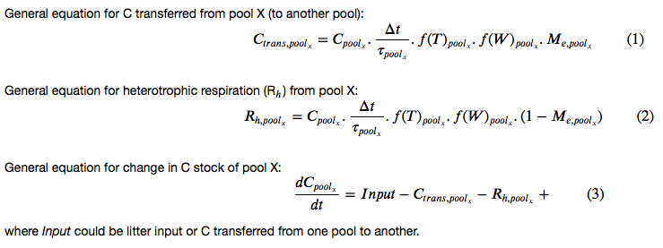

# Simple two pool carbon cycle model

In the in-class exercises we'll be building and analyzing results from a simple two pool carbon model (Fig 1)

*Figure 1: Model schematic of the two pool simple carbon cycle model.*

The two pools correspond to the litter and soil C pools.

Inputs to the model (model "drivers" or "forcings") are litter and soil temperature and moisture and litterfall from leaves falling off trees (as well as turnover of dead wood):
1. Litter input from leaf turnover (during senescence, as well as turnover of dead wood)
2. Temperature in the litter layer
3. Moisture in the litter layer
4. Temperature in the soil layer
5. Moisture in the soil layer

At each timestep, we calculate the fluxes of C between the two pools (transfers of C from litter to the soil pool and vice versa). We also calculate the C lost from each pool via heterotrophic respiration (Rh). Finally, we calculate the changes in C in each C pool as a sum of the inputs minus outputs to and from each pool.

The general equations for this model are as follows:

The model parameters are: 
#### Parameters for the environmental limitations
- Q10: Q10 temperature limitation on heterotrophic respiration (Rh)
- Tref: reference temperature for Q10 equation (Kelvin)
- Wf_m: 'm' coefficient for the moisture limitation on Rh  
- Wf_x0: 'x0' coefficient for the moisture limitation on Rh 
- Wf_min: minimum value for moisture limitation on Rh
- Wf_max: maximum value for moisture limitation on Rh

#### Parameters for the turnover time of each pool
- tau_litter: turnover time of the litter C pool (years)
- tau_soil: turnover time of the soil C pool (years)

#### Parameters for the microbial efficiency of each pool
- Me_litter: microbial efficiency of the litter pool (fraction)
- Me_soil: microbial efficiency of the soil pool (fraction)

#### Parameters for the initial carbon stock of each pool
- C_litter_t0: initial C stock of the litter pool (kgC/m2)
- C_soil_t0: initial C stock of the soil pool (kgC/m2)

