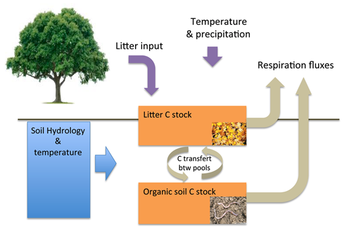

# Simple two pool carbon cycle model

In the in-class exercises we'll be building and analyzing results from a simple two pool carbon model (Fig 1)

*Figure 1: Model schematic of the two pool simple carbon cycle model.*

The two pools correspond to the litter and soil C pools.

Inputs to the model (model "drivers" or "forcings") are litter and soil temperature and moisture and litterfall from leaves falling off trees (as well as turnover of dead wood).

At each timestep, we calculate the fluxes of C between the two pools (transfers of C from litter to the soil pool and vice versa). We also calculate the C lost from each pool via heterotrophic respiration (Rh). Finally, we calculate the changes in C in each C pool as a sum of the inputs minus outputs to and from each pool.

The general equation for the C transferred between each pool is:
\begin{equation*}
C_{tot\_decomp} = C_{pool_x}.\frac{\Delta t}{\tau_{pool_x}}.f(T)_{pool_x}.f(W)_{pool_x}.M_{e,pool_x}\qquad(1)
\end{equation*}

where C$_{pool_x}$ is the C stock of  pool X, *$\Delta$t* is the change in time (i.e. 1 timestep), $\tau_{pool_x}$ is the turnover time of pool X, *f(T)$_{pool_x}$* and *f(W)$_{pool_x}$* are the temperature and moisture limitations for pool X based on the temperature and moisture inputs for that layer, and *M*$_{e,pool_x}$ is the microbial efficiency of pool X, which describes the fraction of C that gets transferred between pools.
